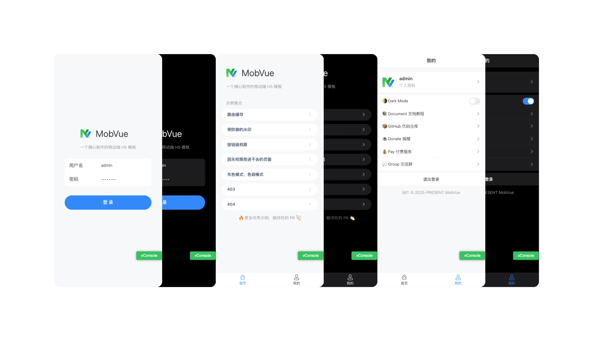

<div align="center">
  
  <h1>Mobile + Vue = MobVue</h1>
</div>

[](https://github.com/un-pany/mobvue/releases)
[](https://github.com/un-pany/mobvue/stargazers)
[](https://gitee.com/un-pany/mobvue/stargazers)

<b>English | <a href="./README.zh-CN.md">中文</a></b>

## Introduction

MobVue is a well-crafted mobile web app template, built with popular technologies such as Vue3, Vite, TypeScript, and Vant

## Notifications

> [!NOTE]
> Powered by love! All source code is free and open-source. If you find it helpful, feel free to give a star to support!

> [!TIP]
> Paid services are officially launched! If you don’t want to do it yourself but want to remove TS or other modules, try the lazy package! [Click to check it out](https://github.com/un-pany/mobvue/issues/2)

## Usage

<details>
<summary>Recommended Environment</summary>

<br>

- Latest version of `Visual Studio Code`
- Install the recommended plugins in the `.vscode/extensions.json` file
- `node` 20.x or 22+
- `pnpm` 9.x or 10+
- `bun` latest

</details>

<details>
<summary>Local Development</summary>

<br>

Using `Node` + `pnpm`

```bash
# Install dependencies
pnpm i

# Start the development server
pnpm dev
```

Using `Bun`

```bash
bun i

bun run dev
```

</details>

<details>
<summary>Build</summary>

<br>

Using `Node` + `pnpm`

```bash
# Build for the staging environment
pnpm build:staging

# Build for the production environment
pnpm build
```

Using `Bun`

```bash
bun run build:staging

bun run build
```

</details>

<details>
<summary>Local Preview</summary>

<br>

Using `Node` + `pnpm`

```bash
# Execute the build command first to generate the dist directory, then run the preview command
pnpm preview
```

Using `Bun`

```bash
bun run preview
```

</details>

<details>
<summary>Code Check</summary>

<br>

Using `Node` + `pnpm`

```bash
# Code linting and formatting
pnpm lint

# Unit tests
pnpm test
```

Using `Bun`

```bash
bun run lint

bun run test
```

</details>

<details>
<summary>Commit Guidelines</summary>

<br>

`feat` New feature

`fix` Bug fix

`perf` Performance improvement

`refactor` Code refactoring

`docs` Documentation and comments

`types` Type-related changes

`test` Unit tests related

`ci` Continuous integration, workflows

`revert` Revert changes

`chore` Chores (update dependencies, modify configurations, etc)

</details>

## Links

**Online Preview**: [github-pages](https://un-pany.github.io/mobvue)

**Documentation and Tutorials**: [link](https://juejin.cn/column/7472609448201666599)

**Backend Management System**: [v3-admin-vite](https://github.com/un-pany/v3-admin-vite)

**Chinese Repository**: [gitee](https://gitee.com/un-pany/mobvue)

**Chat Group**: [check how to join](https://github.com/un-pany/mobvue/issues/3)

**Donations**: [buy a coffee for the author](https://github.com/un-pany/mobvue/issues/1)

**Releases & Changelog**: [releases](https://github.com/un-pany/mobvue/releases)

## Features

🔥 Latest [Syntax](https://vuejs.org/api/sfc-script-setup.html), [Configuration](./vite.config.ts), [Dependencies](./package.json)

📍 [Pure Level 1 Route Design](./src/router/index.ts) - Clear and Cache-Friendly

📱 Mobile Adaptation [px2vw](./postcss.config.ts) - Also Wide-Screen Friendly

🌐 Browser Compatibility [@vitejs/plugin-legacy](https://github.com/vitejs/vite/tree/main/packages/plugin-legacy) + [autoprefixer](https://github.com/postcss/autoprefixer) + [browserslist](https://github.com/browserslist/browserslist) - Compatible with multiple browsers and lower versions

🧩 [Layout System](./src/layout) - Configurable

🔒 Permission Control [Page Level](./src/router/guard.ts), [Button Level](./src/pages/demo/permission.vue)

🌗 Theme Mode [Dark Mode](./src/common/assets/styles/variables.css)

🫧 [Embrace Atomic CSS](./uno.config.ts)

📲 [PWA](https://github.com/antfu/vite-plugin-pwa) - Progressive Web App

🔧 [Components](https://github.com/unplugin/unplugin-vue-components) and [API](https://github.com/unplugin/unplugin-auto-import) Auto Import on Demand

🔎 [Husky](./.husky/pre-commit) + [lint-staged](./package.json) + [ESLint](./eslint.config.js) - Code Standardization

💪🏻 Still [TypeScript](./tsconfig.json) - Strict Mode with No `any`

👀 More Features - [Route Cache](./src/pinia/stores/keep-alive.ts), [Defensive Watermark](./src/common/composables/useWatermark.ts), [Grayscale and Colorblind Mode](./src/common/composables/useGrayscaleAndColorblind.ts), [SVG Loader](https://github.com/jpkleemans/vite-svg-loader), [VConsole](./src/plugins/console.ts), [White Screen Loading Animation](./public/app-loading.css), [Unit Tests](./tests), [I18n](./src/plugins/i18n.ts)

## Tech Stack

**Vue3**: Vue3 + script setup with the latest Vue3 Composition API

**Vant**: A lightweight, customizable Vue UI library for mobile web apps

**Pinia**: The legendary Vuex5

**Vite**: Really fast

**Vue Router**: The routing system

**TypeScript**: A superset of JavaScript

**pnpm**: A faster, disk-space-saving package manager

**ESLint**: Code linting and formatting

**Axios**: Sends network requests

**UnoCSS**: A high-performance, flexible atomic CSS engine

**Bun**：A fast JavaScript runtime

## Project Preview Image



## License

[MIT](./LICENSE) License © 2025-PRESENT [pany](https://github.com/pany-ang)
